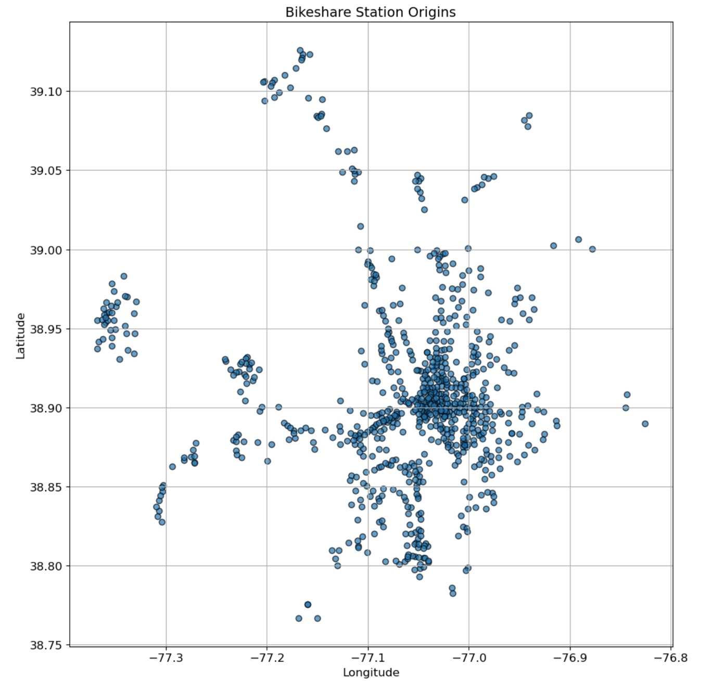

# Unsupervised Spatial Analysis of Capital Bikeshare Stations 
This project explores Capital Bikeshare data (Feb–Apr 2024) by mapping station locations using latitude and longitude. It applies unsupervised learning principles for spatial analysis and visualizes geolocation clusters to uncover usage patterns across stations.

### Basic Information

* **Person or organization developing model**: N M Emran Hussain `nmemran.hussain@gwu.edu`
* **Model date**: March, 2025
* **Model version**: 1.0 
* **License**: [Apache License 2.0](https://github.com/nmemranhussain/RML_A_1_Group_11/blob/main/LICENSE)
* **Model implementation code**: [Assignment](https://github.com/nmemranhussain/6315_A_1/blob/main/6315_A_2.ipynb)

### Training Data

* Data dictionary: 

| Name | Modeling Role | Measurement Level| Description |
|------|---------------|------------------|-------------|
| Date	| Input	| Date	| Date of observation |
| Datetime |	Input	| Date	| Date of observation |
| Tempmax	| Input	|Interval	|Maximum daily temperature (°F) |
| Tempmin	| Input	| Interval	| Minimum daily temperature (°F) |
| Temp	| Input	| Interval	| Average temperature (°F) |
| Feelslikemax	| Input	| Interval	| Maximum feels-like temperature (°F) |
| Feelslikemin	| Input	| Interval	| Minimum feels-like temperature (°F) |
| Feelslike	| Input	| Interval	| Average feels-like temperature (°F) |
| Dew	| Input	| Interval	| Dew point temperature (°F) |
| Humidity	| Input	| Interval	| Humidity percentage |
| Precip	| Input	| Interval	| Total daily precipitation (inches) |
| Precipprob	| Input	 | Interval	| Probability of precipitation (%) |
| Precipcover	| Input	| Interval	| Proportion of the day with precipitation (0 to 1 scale) |
| Snow	| Input	| Interval	| Daily snowfall amount (inches) |
| Snowdepth	| Input	| Interval	| Snow depth on the ground at day's end (inches) |
| Windspeed	| Input	| Interval	| Wind speed (mph) |
| Winddir	| Input	| Interval	| Wind direction (degrees) |
| Sealevelpressure	| Input	| Interval	| Sea level pressure (hPa) |
| Cloudcover	| Input	| Interval	| Cloud cover (%) |
| Visibility	| Input	| Interval	| Visibility (miles) |
| Solarradiation	| Input	| Interval	| Solar radiation (W/m²) |
| Solarenergy	| Input	| Interval	| Solar energy (MJ/m²) |
| Uvindex	| Input	| Interval	| UV index |
| Moonphase	| Input	| Interval	| Moon phase (0=new, 1=full) |
| Icon	| Input	| Nominal	| Weather icon for the day |
| Which_High | Output | Categorical | Whether Pickups or Drop-offs are higher on a given day (PU_High or DO_High) |

- **Source of Taining Dataset Name:** Capital Bikeshare Data ('202402-capitalbikeshare-tripdata.csv', '202403-capitalbikeshare-tripdata.csv', '202404-capitalbikeshare-tripdata.csv' & 'DC_weather_2024.csv')  
- **Number of Samples:** 318689, 436947, 490266 & 367  
- **Features Used:** The project uses the following features from the Capital Bikeshare data: **'start_station_name'** (Name of the station where a trip began), **'start_lat'** (Latitude of the starting station) and **'start_lng'** (Longitude of the starting station)
- **Target variable Used:** This is an unsupervised learning or exploratory data analysis (EDA) project, so there is no target variable—only features used to understand spatial distribution and patterns.
- **Data Source:** [capitalbikeshare-data](https://s3.amazonaws.com/capitalbikeshare-data/index.html)
- **How training data was divided into training and test data**: The project does not split data into training and testing sets.
- **Type of model**: K-means, K-medians and K-mediods
- **Software used to implement the model**: Python, scikit-learn, pyclustering, scipy
- **Version of the modeling software**: numpy: 2.0.2, pandas: 2.2.2, matplotlib: 3.10.0, Python 3.11.12, scikit-learn version: 1.5.1, pyclustering version: 0.10.1.2, scipy version: 1.13.1

### Evaluation Metrics
In this project, the within-cluster sum of squares (WSS), also known as inertia, is used to evaluate how compact the clusters formed by the KMeans algorithm are. WSS measures the total squared distance between each data point and its assigned cluster center—lower values indicate tighter, more cohesive clusters. To determine the optimal number of clusters (k), the elbow method is applied by plotting WSS against varying values of k. In the context of Capital Bikeshare station data, this helps identify the ideal number of spatial groupings based on station latitude and longitude. The "elbow" point—where WSS starts to decrease more slowly—suggests a balance between minimizing intra-cluster variance and avoiding overfitting with too many clusters. This method enables meaningful spatial segmentation of bike stations for better understanding and planning.

### Quantitative Analysis

  
Figure 1. All location of bikeshare station origin
