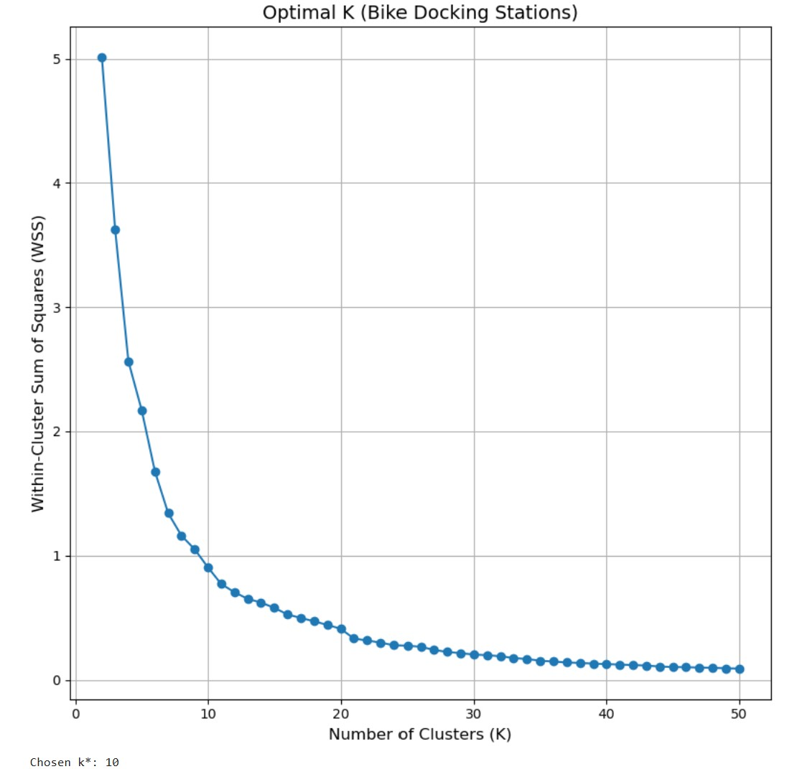
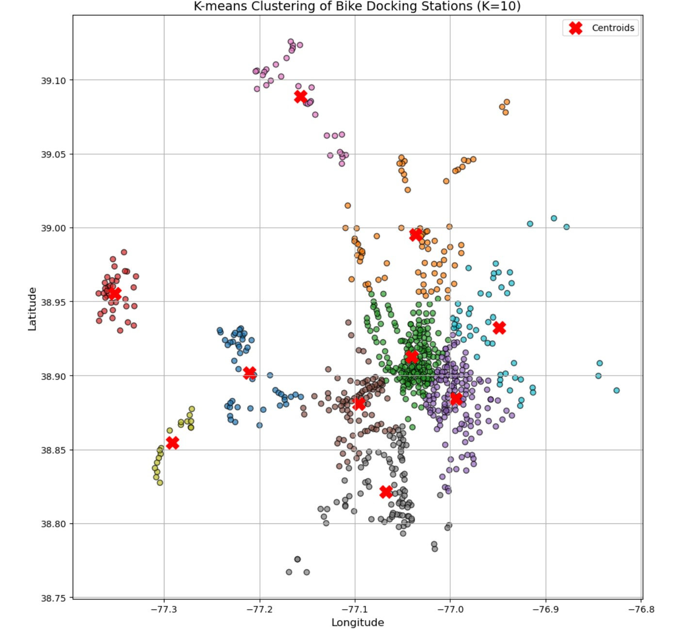
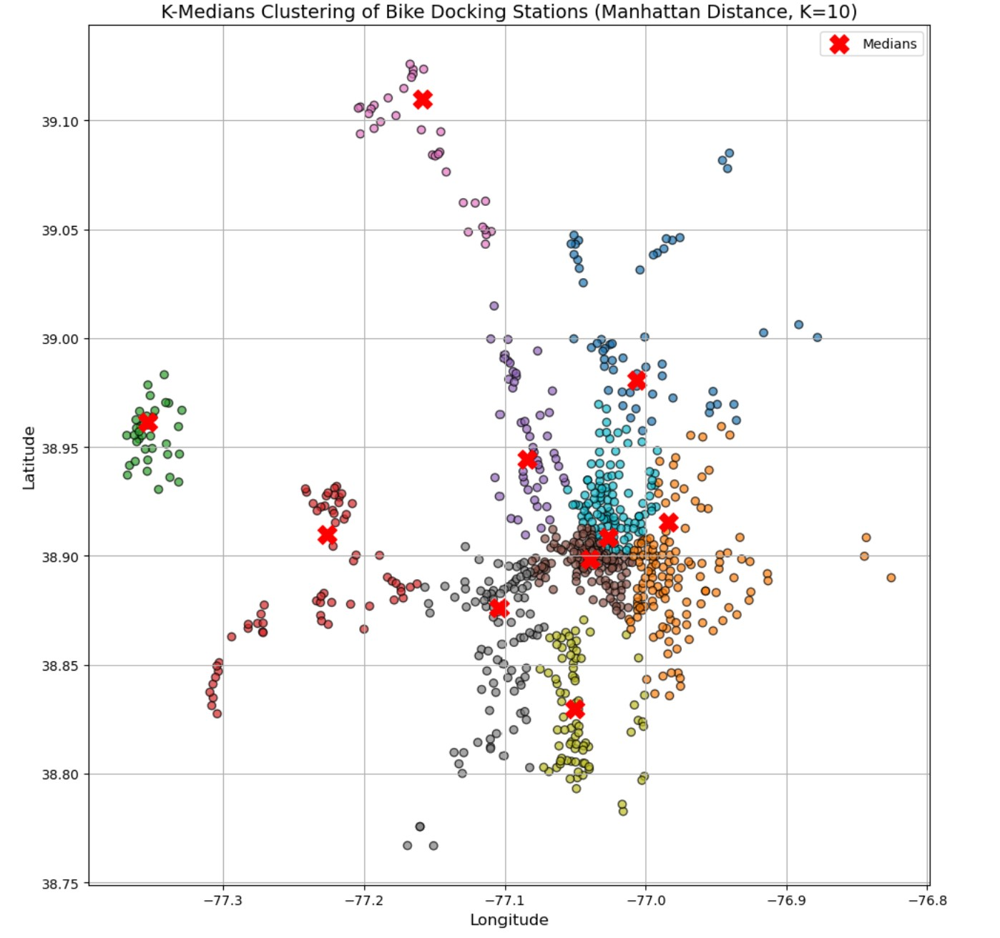
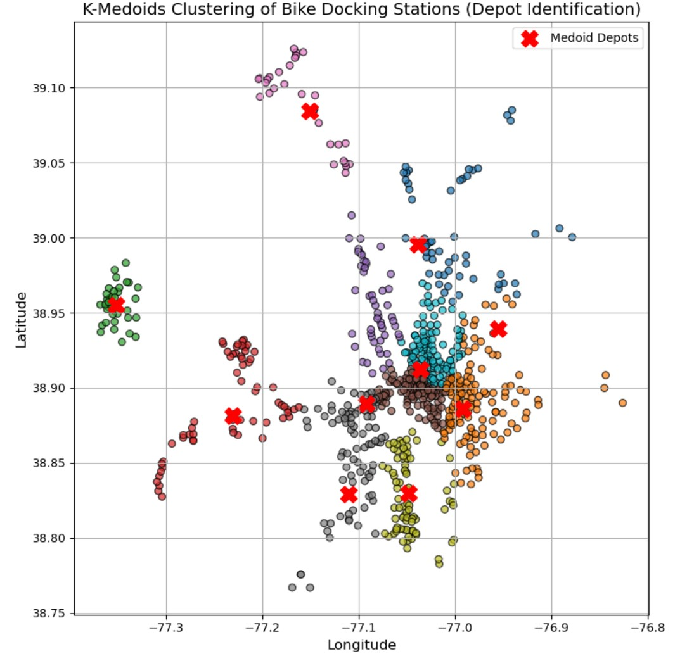
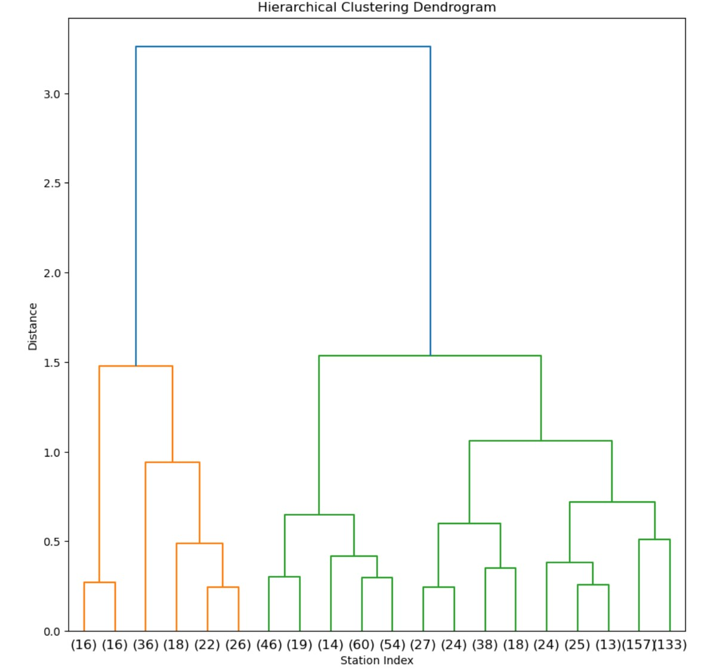
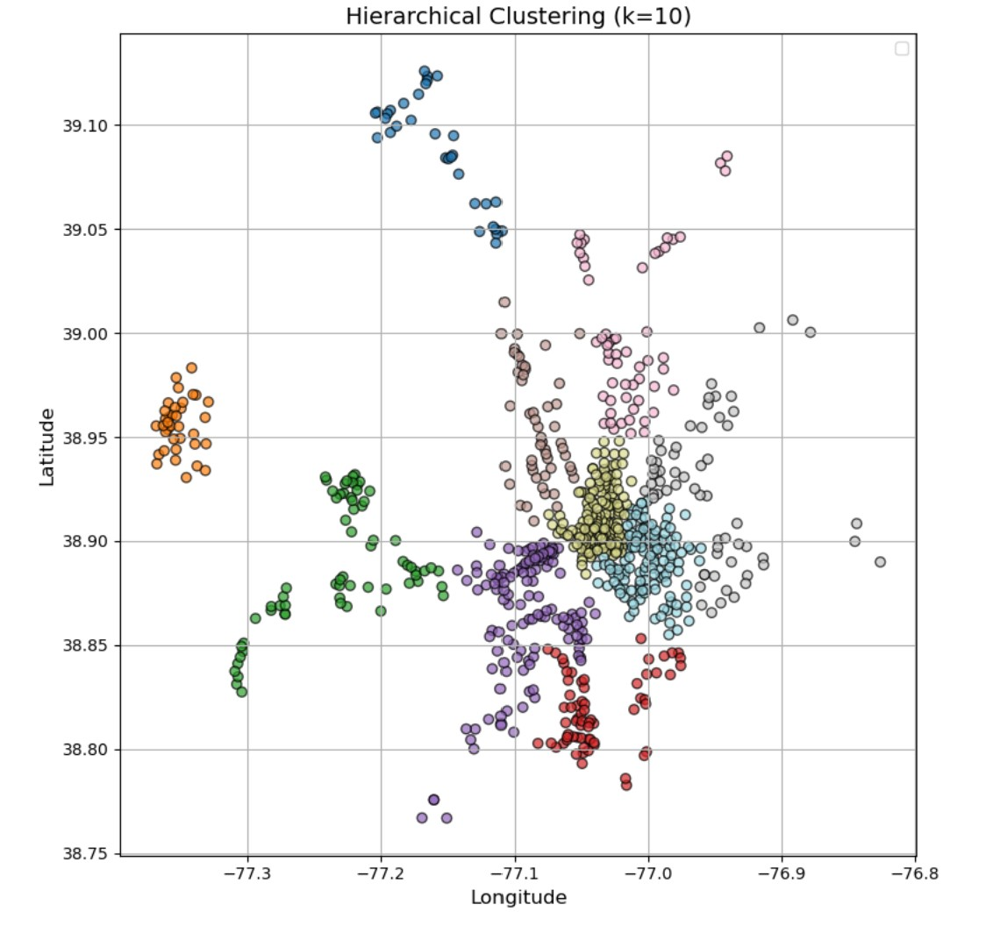

# Unsupervised Spatial Analysis of Capital Bikeshare Stations 
This project explores Capital Bikeshare data (Feb–Apr 2024) by mapping station locations using latitude and longitude. It applies unsupervised learning principles for spatial analysis and visualizes geolocation clusters to uncover usage patterns across stations.

### Basic Information

* **Person or organization developing model**: N M Emran Hussain `nmemran.hussain@gwu.edu`
* **Model date**: March, 2025
* **Model version**: 1.0 
* **License**: [Apache License 2.0](https://github.com/nmemranhussain/RML_A_1_Group_11/blob/main/LICENSE)
* **Model implementation code**: [Assignment](https://github.com/nmemranhussain/6315_A_2/blob/main/6315_A_2.ipynb)

### Training Data

* Data dictionary: 

| Name | Modeling Role | Measurement Level| Description |
|------|---------------|------------------|-------------|
| Date	| Input	| Date	| Date of observation |
| Datetime |	Input	| Date	| Date of observation |
| Tempmax	| Input	|Interval	|Maximum daily temperature (°F) |
| Tempmin	| Input	| Interval	| Minimum daily temperature (°F) |
| Temp	| Input	| Interval	| Average temperature (°F) |
| Feelslikemax	| Input	| Interval	| Maximum feels-like temperature (°F) |
| Feelslikemin	| Input	| Interval	| Minimum feels-like temperature (°F) |
| Feelslike	| Input	| Interval	| Average feels-like temperature (°F) |
| Dew	| Input	| Interval	| Dew point temperature (°F) |
| Humidity	| Input	| Interval	| Humidity percentage |
| Precip	| Input	| Interval	| Total daily precipitation (inches) |
| Precipprob	| Input	 | Interval	| Probability of precipitation (%) |
| Precipcover	| Input	| Interval	| Proportion of the day with precipitation (0 to 1 scale) |
| Snow	| Input	| Interval	| Daily snowfall amount (inches) |
| Snowdepth	| Input	| Interval	| Snow depth on the ground at day's end (inches) |
| Windspeed	| Input	| Interval	| Wind speed (mph) |
| Winddir	| Input	| Interval	| Wind direction (degrees) |
| Sealevelpressure	| Input	| Interval	| Sea level pressure (hPa) |
| Cloudcover	| Input	| Interval	| Cloud cover (%) |
| Visibility	| Input	| Interval	| Visibility (miles) |
| Solarradiation	| Input	| Interval	| Solar radiation (W/m²) |
| Solarenergy	| Input	| Interval	| Solar energy (MJ/m²) |
| Uvindex	| Input	| Interval	| UV index |
| Moonphase	| Input	| Interval	| Moon phase (0=new, 1=full) |
| Icon	| Input	| Nominal	| Weather icon for the day |
| Which_High | Output | Categorical | Whether Pickups or Drop-offs are higher on a given day (PU_High or DO_High) |

- **Source of Taining Dataset Name:** Capital Bikeshare Data ('202402-capitalbikeshare-tripdata.csv', '202403-capitalbikeshare-tripdata.csv', '202404-capitalbikeshare-tripdata.csv' & 'DC_weather_2024.csv')  
- **Number of Samples:** 318689, 436947, 490266 & 367  
- **Features Used:** The project uses the following features from the Capital Bikeshare data: **'start_station_name'** (Name of the station where a trip began), **'start_lat'** (Latitude of the starting station) and **'start_lng'** (Longitude of the starting station)
- **Target variable Used:** This is an unsupervised learning or exploratory data analysis (EDA) project, so there is no target variable—only features used to understand spatial distribution and patterns.
- **Data Source:** [capitalbikeshare-data](https://s3.amazonaws.com/capitalbikeshare-data/index.html)
- **How training data was divided into training and test data**: The project does not split data into training and testing sets.
- **Type of model**: K-means, K-medians and K-mediods
- **Software used to implement the model**: Python, scikit-learn, pyclustering, scipy
- **Version of the modeling software**: numpy: 2.0.2, pandas: 2.2.2, matplotlib: 3.10.0, Python 3.11.12, scikit-learn version: 1.5.1, pyclustering version: 0.10.1.2, scipy version: 1.13.1

### Evaluation Metrics
In the context of this project, the within-cluster sum of squares (WSS)—also known as inertia—is used to evaluate the compactness of clusters formed by the KMeans algorithm. WSS measures the total squared distance between each point and its assigned cluster center. To identify the optimal number of clusters (K), the project applies the elbow method, which involves plotting WSS against a range of K values and looking for a point where the rate of decrease sharply slows down—forming an "elbow" shape. This indicates that adding more clusters beyond this point yields diminishing returns in terms of clustering quality. In this project, the elbow was observed around K = 10, suggesting it strikes a balance between underfitting (too few clusters) and overfitting (too many clusters), and effectively captures the spatial distribution of bikeshare stations in Washington, D.C.

### Quantitative Analysis

  
Figure 1. All location of bikeshare station origin

  
Figure 1. Finiding optimal K using WSS elbow method

  
Figure 1. K-means clustering of bike docking station using K=10

  
Figure 1. K-medians clustering of bike docking station using K=10 and Manhatten Distance

  
Figure 1. K-medoids clustering of bike docking station using K=10 

  
Figure 1. Hierarchical clustering dendogram

  
Figure 1. Hierarchical Clustering Using K=10

### Observations on Clustering Pattern Differences Across the Four Methods
The different clustering methods reveal distinct patterns in how bike docking stations are grouped. K-Means clustering, using Euclidean distance, forms relatively round, centralized clusters, but can be influenced by dense downtown areas, pulling centroids toward them. K-Medians clustering, based on Manhattan distance, results in more compact and elongated clusters, making it more robust to outliers and better suited to urban street layouts. K-Medoids clustering, where actual stations serve as cluster centers, provides practical groupings ideal for depot placement and operational purposes, as it identifies real, meaningful hubs. In contrast, hierarchical clustering does not assume spherical shapes and instead creates more natural but irregular groupings, capturing localized pockets of bike stations that reflect the underlying geographical distribution more organically. Overall, K-Means emphasizes mathematical neatness, K-Medians and K-Medoids offer more practical and resilient clustering for real-world applications, and hierarchical clustering highlights the natural structure of the bikeshare network.

### Practical Evaluation Strategy for Crew Deployment Clustering as a System Planner
As a system planner, evaluating these clustering plans for crew deployment should focus on operational efficiency, real-world accessibility, and service reliability rather than just mathematical clustering quality. Practically, I would prioritize clusters that group stations closely in terms of actual travel time (not just distance), minimize outlier stations, and ensure that each crew’s coverage area is geographically manageable within typical shift limits. K-Medoids would be highly attractive because the centers are actual bike stations, making it easier to set up depots or starting points for crews. I would also consider K-Medians if street layouts and traffic patterns (e.g., grid-like cities) make Manhattan distance more realistic for estimating travel efforts. Hierarchical clustering could help identify natural neighborhoods or districts, which might align well with political or administrative zones for assigning teams. Ultimately, the decision would involve simulating travel routes, crew workload balance, and response times under each clustering plan to pick the approach that best minimizes total operational cost and maximizes station service reliability.

### Ethical Consideration
An important ethical consideration in this project involves ensuring that clustering outcomes do not inadvertently reinforce inequities in access to transportation services. While spatial clustering of bikeshare stations helps optimize crew deployment and resource allocation, it is essential to evaluate whether these clusters align with diverse community needs, especially in underserved or low-income areas. Ethical planning should consider fairness in service availability and avoid bias toward high-traffic or affluent neighborhoods. Additionally, any future use of user data for modeling must respect privacy, ensure anonymization, and comply with data protection standards to maintain public trust.
